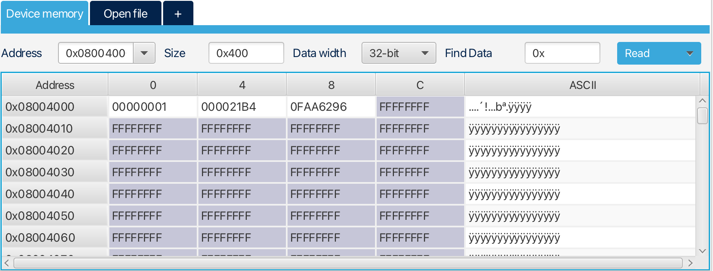
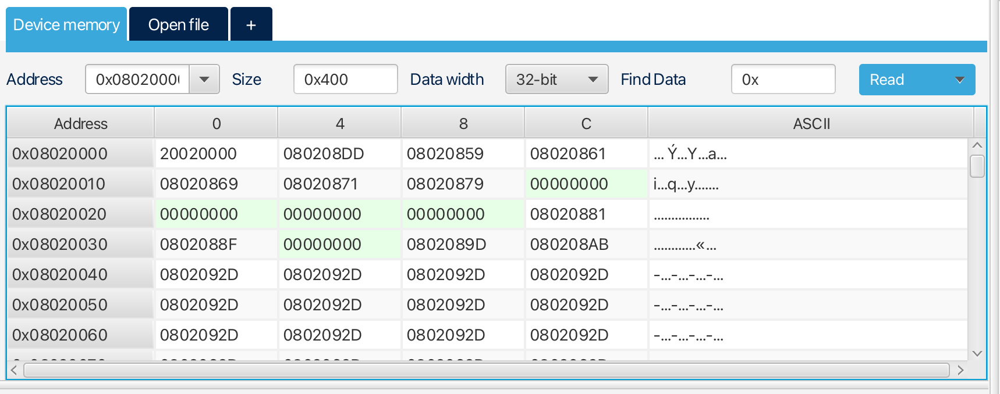
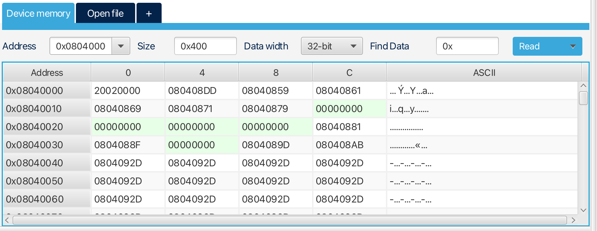

# Custom STM32 Bootloader

A custom UART-based bootloader for STM32 microcontrollers that enables reliable in-field firmware updates using a packet-based communication protocol. The project implements dual application slots, CRC-based image validation, flash memory management, and a Python host utility for transferring firmware images.

The goal of this project was to understand and implement the complete firmware update pipeline, from image transfer and flash programming to image validation and application handoff.

---

# Features

- UART-based firmware update mechanism
- Custom packet-oriented communication protocol
- ACK/NACK based communication
- CRC32 image verification
- Dual application slot architecture
- Flash-resident boot configuration
- Application image validation before execution
- Automatic slot switching after successful update
- Packet retransmission support
- Python-based firmware upload utility
- Modular bootloader architecture

---

# System Architecture

```text
+-------------------------+
|       Bootloader        |
|      0x08000000         |
+-------------------------+
|    Boot Configuration   |
+-------------------------+
|      APP Slot 0         |
+-------------------------+
|      APP Slot 1         |
+-------------------------+
```

The bootloader remains permanently resident in Flash and is responsible for:

1. Receiving firmware images over UART.
2. Storing images into the inactive application slot.
3. Verifying image integrity using CRC32.
4. Updating boot configuration.
5. Launching the selected application image.

---

# Firmware Update Workflow

```text
          +-------------+
          |  PC Host    |
          +-------------+
                 |
                 | UART
                 v
      +--------------------+
      |    Bootloader      |
      +--------------------+
                 |
                 v
      Receive Firmware Packets
                 |
                 v
      Program Inactive Slot
                 |
                 v
          CRC Verification
                 |
         +-------+-------+
         |               |
         | Pass          | Fail
         |               |
         v               v
 Update Boot Config   Reject Image
         |
         v
       Reset
         |
         v
 Execute New Firmware
```

---

# Communication Protocol

Firmware images are divided into packets and transmitted sequentially.

### Data Packet Structure

```text
+-------------+--------+---------+--------+---------+----------+
| Header      | Type   | Address | Length | Payload | CRC32    |
+-------------+--------+---------+--------+---------+----------+
| 0xAA 0x55   | 1 Byte | 4 Bytes | 2 Bytes| N Bytes | 4 Bytes  |
+-------------+--------+---------+--------+---------+----------+
```

### End of Communication (EOC) Packet

```text
+-------------+------+------------+-----------+----------+
| Header      | Type | Image Size | Image CRC | CRC32    |
+-------------+------+------------+-----------+----------+
| 0xAA 0x55   | EOC  | 4 Bytes    | 4 Bytes   | 4 Bytes  |
+-------------+------+------------+-----------+----------+
```

Protocol capabilities:

- Packet sequencing
- Corruption detection
- ACK/NACK responses
- Retransmission support
- End-of-Communication packet handling
- Image CRC verification

---

# Boot Configuration

The bootloader maintains a configuration structure in Flash that stores:

- Active application slot
- Image CRC
- Image validity information

The configuration determines which application image will be executed after reset.

---

# Image Validation

Before jumping to an application, the bootloader performs:

1. Application existence check
2. Vector table validation
3. CRC verification
4. Slot selection verification

Only validated firmware images are executed.

If validation fails, the bootloader remains active and waits for a new firmware image.

---

# Python Host Utility

The project includes a Python-based programming utility that handles firmware transfer.

Features:

- Binary image upload
- Packet generation
- CRC generation
- Retransmission handling
- Progress monitoring
- End-of-transfer verification

Example:

```bash
python programmer.py
```

---

# Debugging Notes

During development several issues were encountered that were difficult to identify initially. These notes may help future development and debugging.

## LED Based Debugging

One of the most useful debugging techniques was temporarily adding LED blink patterns at different locations in the bootloader code.

Examples:

- Bootloader startup
- Packet reception
- Flash programming
- CRC verification
- Application jump

This helped identify execution flow when UART output was unavailable or when debugging startup code.

---

## Chunk Size Must Be Divisible by 4

The Python host utility currently requires the packet chunk size to be divisible by 4.

Reason:

STM32 Flash programming is performed using word-aligned writes. Non-aligned chunk sizes can result in invalid writes and corrupted firmware images.

Examples:

Valid:

```text
128 Bytes
256 Bytes
512 Bytes
1024 Bytes
```

Invalid:

```text
127 Bytes
250 Bytes
513 Bytes
```

---

# Problems Faced During Development

## Protocol Bugs Looking Like Flash Bugs

Several failures initially appeared to be Flash programming issues but were eventually traced back to protocol implementation mistakes.

This reinforced the importance of validating communication layers before debugging memory programming code.

---

## CRC Verification Was Extremely Valuable

CRC checks made it possible to quickly determine whether a failure originated from:

- UART communication corruption
- Packet assembly issues
- Flash programming issues
- Invalid application images

Without CRC verification, debugging firmware update failures would have been significantly more difficult.

---

## Small Assumptions Caused Big Headaches

Some of the most time-consuming bugs weren't caused by complex logic, but by small assumptions that turned out to be wrong.

Examples included:

- Incorrect packet length calculations
- Wrong address offsets during Flash operations
- Ignoring Flash alignment requirements
- Mistakes in application slot selection

In many cases, the code looked correct at first glance, making these issues difficult to spot. Most of them were eventually tracked down by adding extra validation checks, UART debug messages, and LED-based debugging.

One of the biggest lessons from this project was to verify every assumption, no matter how obvious it seems. A single incorrect assumption can easily lead to hours of debugging.

---

# Demo

## Boot Configuration



## Application Slot 0



## Application Slot 1



## Video Demonstration

```markdown

```

- Video is also available in Media folder

---

# Project Structure

```text
Custom_bootloader/
│
├── Firmware/
│   ├── Bootloader/
│   └── Application/
│
├── application binary files/
│
├── Media/
│   ├── APP_0_start.png
│   ├── APP_1_start.png
│   ├── BootLoader_cfg.png
│   └── demo.mp4
│
├── programmer.py
│
└── README.md
```

---

# Current Limitations

### Single-Sector Application Assumption

The current implementation assumes each application image occupies only one Flash sector.

This works for small firmware images but limits scalability.

### Manual Application Start Address

The host utility currently requires the user to manually specify the application start address.

Incorrect addresses may result in failed firmware updates or invalid application execution.

### Fixed Packet Size

Packet size is currently predefined on both the host and bootloader.

Both sides must use matching values.

---

# Future Improvements

## 1. Uniform ACK Packet Structure

Currently ACK responses use a simplified format.

Future versions will standardize ACK/NACK packets to use the same structure as other protocol packets.

Benefits:

- Cleaner protocol implementation
- Easier parser maintenance
- Improved scalability

---

## 2. MTU Negotiation Packet

Currently packet size must be configured manually.

A future handshake phase will include an MTU Request packet that allows the host and bootloader to negotiate the maximum supported packet size.

Benefits:

- Automatic packet size selection
- Improved flexibility
- Better compatibility

---

## 3. Multi-Sector Application Support

Current implementation assumes one Flash sector per application.

Future versions will support:

- Multiple sectors per application
- Larger firmware images
- Dynamic image sizing

Benefits:

- Better Flash utilization
- Increased application size limits
- More flexible memory layouts

---

## 4. Automatic Application Address Selection

Currently users must manually enter the application start address.

Future versions will automatically determine the correct address based on the selected application slot and bootloader configuration.

Benefits:

- Simpler user experience
- Reduced configuration errors
- Easier deployment

---

## 5. Desktop GUI Programming Utility

Planned features:

- Binary file browser
- Slot selection
- Progress visualization
- Automatic packet configuration
- Device information display

---

## 6. Firmware Version Management

Potential additions:

- Firmware version tracking
- Version compatibility checks
- Update history storage

---

## 7. Secure Firmware Updates

Long-term improvements:

- Firmware signing
- Authentication
- AES encrypted firmware images

---

# Technologies Used

- STM32
- Embedded C
- UART Communication
- Flash Memory Management
- CRC32 Verification
- Python 3

---

# Author

**Mandar Sewalkar**

Embedded Systems | Firmware Development | FPGA Design | Digital Design

If you found this project useful, feel free to star the repository.
